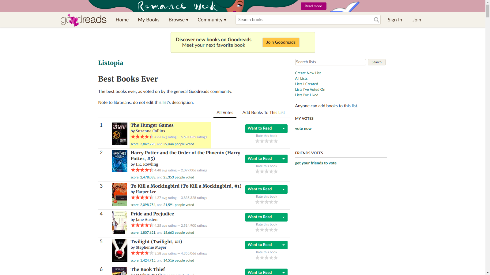
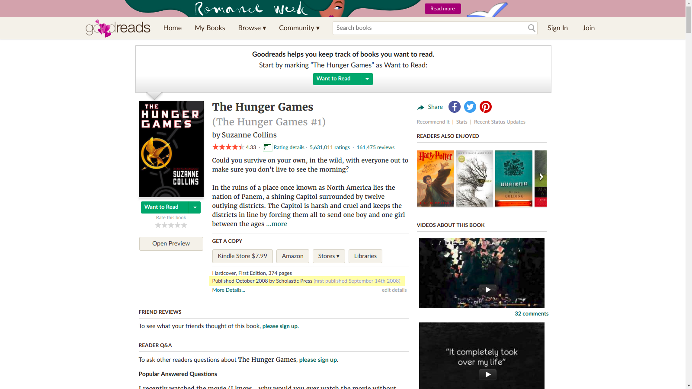
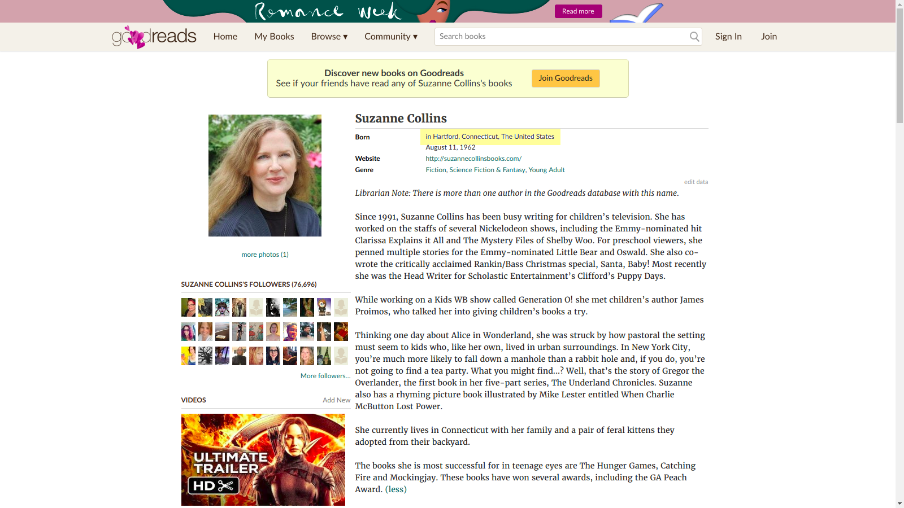

# Good Reads Capstone

# Goal

To utilize webscraping to better understand the characteristics of books in Goodreads's Best Books Ever list. (https://www.goodreads.com/list/show/1.Best_Books_Ever) This is a user generated list where the community is encouraged to vote on books that are the best to them. There is no limit on how many books a user can vote for. I scraped for the title, author name, author's country of origin, genre, year of book release, number of votes, average ratings, number of ratings. There was information of demographics of Good Readers user based on country that was used. This information was provided by Otis Chandler, CEO of GoodReads on a GoodReads forum. (https://www.goodreads.com/topic/show/346243-members-by-country?comment_id=17392983#comment_17431975)

# Page Set Up

  

# Tools Used

Python Programming and the Beautiful Soup, Pandas, and Matplotlib Libraries

People read books, but where are the authors coming from?

# Web Scraping
Used Python Library of requests and Beautiful Soup
Link: https://www.goodreads.com/shelf/show/currently-reading?page=1

# Database
Pipelined the webscraping to go through a Mongos Database.

# EDA

# Study

#Looking Beyond
